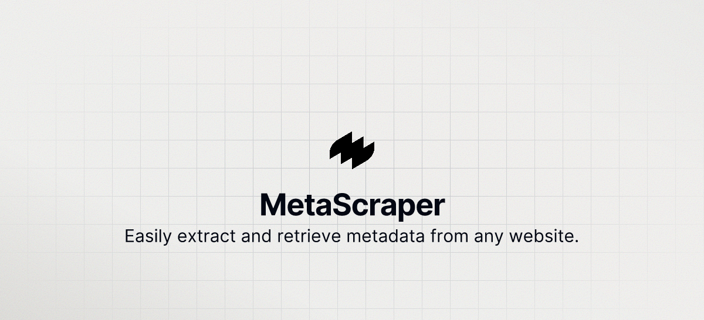

# MetaScraper - Website Metadata Extractor

MetaScraper is a powerful web application built with Next.js that allows users to easily extract and retrieve metadata from any website. The extracted metadata includes the title, OG image, description, and more, making it an essential tool for web scraping and SEO optimization.



## Features

- Extract title, description, OG image, and other metadata from websites
- Dark mode and light mode support with dynamic favicon switching
- Built with Next.js for server-side rendering and static site generation
- Responsive and modern UI design


## Tech Stack

- [Next.js](https://nextjs.org)
- [Tailwind CSS](https://tailwindcss.com)
- [Vercel](https://vercel.com)
- [Logo](https://www.logoshaper.co/)
- SCSS
- Axios
- Cheerio


## Demo

Check out the live demo [here](https://meta-scrapper.vercel.app/).

## Installation

To get started with MetaScraper, follow these steps:

1. **Clone the repository**

   ```bash
   git clone https://github.com/Drealdumore/MetaScraper.git
   cd MetaScraper
   ```

2. **Install dependencies**

   ```bash
   npm install
   ```

3. **Run the development server**

   ```bash
   npm run dev
   ```

Open [http://localhost:3000](http://localhost:3000) with your browser to see the result.

## Usage

1. Enter the URL of the website you want to scrape in the input field.
2. Click on the "Scrape Metadata" button.
3. View the extracted metadata displayed on the page.

## Contributing

Contributions are welcome! Please open an issue or submit a pull request for any improvements or bug fixes.

## License

This project is licensed under the MIT License.

## Contact

- **GitHub**: [Drealdumore](https://github.com/Drealdumore)
- **Twitter**: [drealdumore](https://twitter.com/drealdumore)
